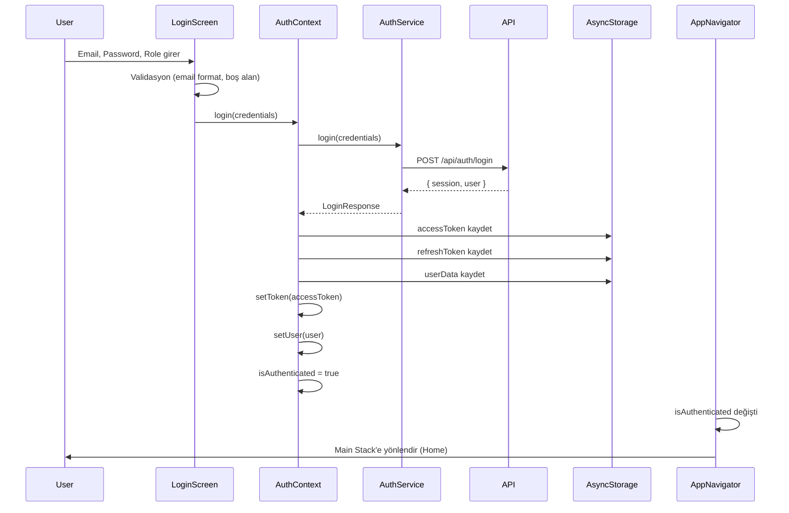
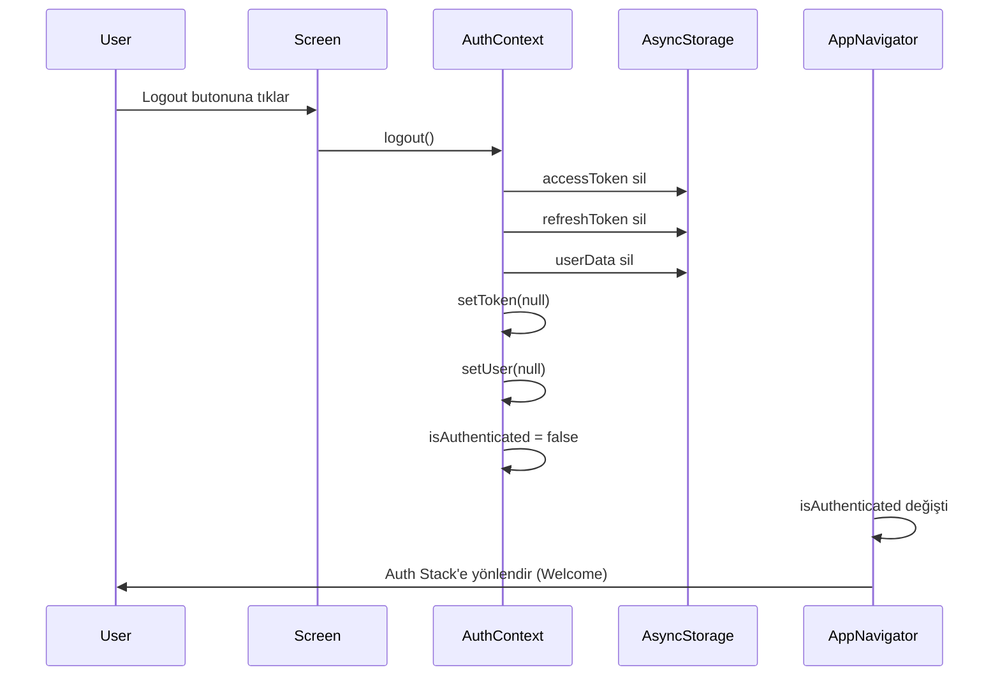
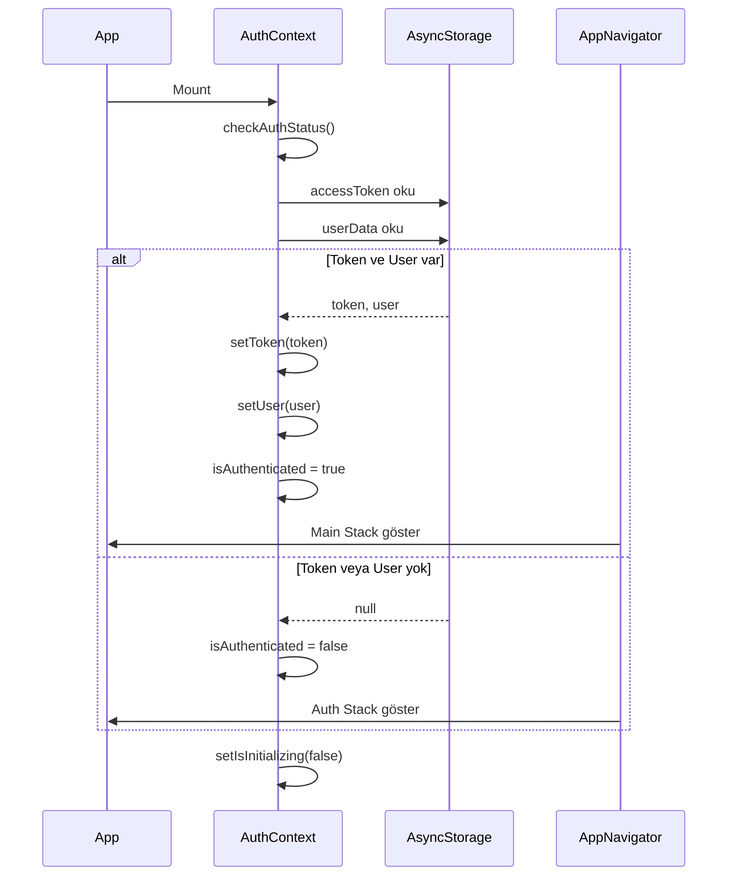

# Authentication System Documentation

## 📋 İçindekiler

1. [Genel Bakış](#genel-bakış)
2. [Mimari](#mimari)
3. [Bileşenler](#bileşenler)
4. [Authentication Flow](#authentication-flow)
5. [API Entegrasyonu](#api-entegrasyonu)
6. [Kullanım Örnekleri](#kullanım-örnekleri)
7. [Güvenlik](#güvenlik)

---

## Genel Bakış

GridironHub uygulaması, **session-based token authentication** sistemi kullanmaktadır. Sistem, kullanıcıların Coach veya Player rolü ile giriş yapmasını sağlar ve otomatik token yönetimi ile güvenli bir authentication deneyimi sunar.

### Temel Özellikler

- ✅ Role-based authentication (Coach/Player)
- ✅ Session-based token management (Access Token + Refresh Token)
- ✅ Persistent authentication (AsyncStorage)
- ✅ Automatic navigation based on auth state
- ✅ Secure token storage
- ✅ Request interceptors for automatic token injection

---

## Mimari

### Katmanlar

```
┌─────────────────────────────────────────┐
│         UI Layer (Screens)              │
│  - Welcome.tsx                          │
│  - Login.tsx                            │
│  - SignUp.tsx                           │
└────────────┬────────────────────────────┘
             │
             │ useAuth()
             ▼
┌─────────────────────────────────────────┐
│      Context Layer (AuthContext)        │
│  - State management                     │
│  - Authentication logic                 │
│  - Token storage                        │
└────────────┬────────────────────────────┘
             │
             │ authService
             ▼
┌─────────────────────────────────────────┐
│       API Layer (Services)              │
│  - auth.service.ts                      │
│  - HTTP client (axios)                  │
└────────────┬────────────────────────────┘
             │
             │ HTTP Requests
             ▼
┌─────────────────────────────────────────┐
│          Backend API                    │
│  - /api/auth/login                      │
│  - /api/auth/register                   │
└─────────────────────────────────────────┘
```

### Navigation Flow

```
┌──────────────────┐
│  AppNavigator    │
│  (Root Stack)    │
└────────┬─────────┘
         │
         │ isAuthenticated?
         │
    ┌────┴────┐
    │         │
    NO       YES
    │         │
    ▼         ▼
┌────────┐ ┌────────┐
│  Auth  │ │  Main  │
│ Stack  │ │ Stack  │
└────────┘ └────────┘
    │         │
    ▼         ▼
┌────────┐ ┌────────┐
│Welcome │ │  Tabs  │
│ Login  │ │  Home  │
│ SignUp │ │Profile │
└────────┘ └────────┘
```

---

## Bileşenler

### 1. AuthContext (`contexts/AuthContext.tsx`)

Authentication state'ini yöneten ana context.

#### State

```typescript
interface AuthContextType {
  user: AuthUser | null; // Kullanıcı bilgileri
  token: string | null; // Access token
  isAuthenticated: boolean; // Auth durumu
  isLoading: boolean; // Loading state
  login: (credentials) => Promise<void>;
  register: (data) => Promise<void>;
  logout: () => Promise<void>;
  updateUser: (user) => void;
}
```

#### AuthUser Interface

```typescript
interface AuthUser {
  id: string;
  email: string;
  role: UserRole; // 'coach' | 'player'
  metadata: Record<string, unknown>;
}
```

#### Storage Keys

```typescript
const STORAGE_KEYS = {
  ACCESS_TOKEN: 'accessToken', // Ana authentication token
  REFRESH_TOKEN: 'refreshToken', // Token yenileme için
  USER: 'userData', // Kullanıcı bilgileri
};
```

### 2. Auth Service (`api/services/auth.service.ts`)

API çağrılarını yöneten servis katmanı.

#### Methods

- **`login(data: LoginRequest)`**: Kullanıcı girişi
- **`register(data: RegisterRequest)`**: Yeni kullanıcı kaydı
- **`forgotPassword(email: string)`**: Şifre sıfırlama

### 3. API Client (`api/client.ts`)

Axios instance ve interceptor'lar.

#### Request Interceptor

- Public route kontrolü
- Access token'ı otomatik olarak header'a ekler
- `Authorization: Bearer {token}` formatında

#### Response Interceptor

- 401 hatalarını yakalar
- Token yenileme mekanizması için hazır

### 4. Navigation (`navigation/AppNavigator.tsx`)

Authentication durumuna göre ekranları yöneten navigator.

```typescript
const renderScreens = useCallback(() => {
  if (isAuthenticated) {
    return <RootStack.Screen name={AppRoutes.MAIN} component={MainNavigator} />;
  }
  return <RootStack.Screen name={AppRoutes.AUTH} component={AuthNavigator} />;
}, [isAuthenticated]);
```

---

## Authentication Flow

### Login Flow



### Logout Flow



### App Initialization Flow



---

## API Entegrasyonu

### Login Request

**Endpoint:** `POST /api/auth/login`

**Request Body:**

```typescript
{
  email: string;
  password: string;
  role: 'coach' | 'player';
}
```

**Response:**

```typescript
{
  session: {
    accessToken: string;
    refreshToken: string;
    expiresIn: number;
    tokenType: string;
  }
  user: {
    id: string;
    email: string;
    role: UserRole;
    metadata: Record<string, unknown>;
  }
}
```

### Register Request

**Endpoint:** `POST /api/auth/register`

**Request Body:**

```typescript
{
  email: string;
  password: string;
  firstName: string;
  lastName: string;
}
```

**Response:**

```typescript
{
  data: {
    user: User;
    token: string;
  }
}
```

### Protected API Requests

Tüm korumalı endpoint'ler için axios interceptor otomatik olarak token ekler:

```typescript
headers: {
  'Authorization': 'Bearer {accessToken}'
}
```

**Public Routes** (token gerektirmez):

- `/industries`
- `/auth/login`
- `/register`

---

## Kullanım Örnekleri

### 1. Login Screen'de Kullanım

```typescript
import { useAuth } from '@/contexts/AuthContext';

export const Login = () => {
  const { login, isLoading } = useAuth();

  const handleLogin = async () => {
    try {
      await login({
        email: email.trim(),
        password,
        role: 'coach'
      });
      // Navigation otomatik olarak gerçekleşir
    } catch (error) {
      // Hata yönetimi
      Alert.alert('Login Error', error.message);
    }
  };

  return (
    <TouchableOpacity
      onPress={handleLogin}
      disabled={isLoading}
    >
      {isLoading ? <ActivityIndicator /> : <Text>Login</Text>}
    </TouchableOpacity>
  );
};
```

### 2. Protected Screen'de Kullanım

```typescript
import { useAuth } from '@/contexts/AuthContext';

export const ProfileScreen = () => {
  const { user, logout } = useAuth();

  return (
    <View>
      <Text>Welcome, {user?.email}</Text>
      <Text>Role: {user?.role}</Text>
      <Button title="Logout" onPress={logout} />
    </View>
  );
};
```

### 3. Conditional Rendering

```typescript
import { useAuth } from '@/contexts/AuthContext';

export const SomeScreen = () => {
  const { isAuthenticated, user } = useAuth();

  if (!isAuthenticated) {
    return <LoginPrompt />;
  }

  return (
    <View>
      {user?.role === 'coach' && <CoachFeatures />}
      {user?.role === 'player' && <PlayerFeatures />}
    </View>
  );
};
```

### 4. API Call with Authentication

```typescript
// Otomatik olarak token eklenir
const response = await axiosInstance.get('/api/protected-endpoint');

// Manuel token kullanımı gerekmez
// Interceptor otomatik olarak Authorization header'ı ekler
```

---

## Güvenlik

### Token Storage

- **AsyncStorage** kullanılıyor (şu anda)
- **Önerilen:** Hassas veriler için `expo-secure-store` kullanımı
- Access token ve refresh token ayrı ayrı saklanıyor

### Token Lifecycle

1. **Login**: Access token ve refresh token alınır
2. **Storage**: Her iki token da AsyncStorage'a kaydedilir
3. **Usage**: Access token her API isteğinde kullanılır
4. **Expiration**: Token süresi dolduğunda refresh token ile yenilenir (TODO)
5. **Logout**: Tüm token'lar silinir

### Best Practices

✅ **Yapılanlar:**

- Token'lar ayrı key'lerde saklanıyor
- Public route'lar için token gönderilmiyor
- 401 hatası yakalanıyor
- Logout'ta tüm veriler temizleniyor

⚠️ **Yapılacaklar:**

- [ ] Expo SecureStore entegrasyonu
- [ ] Refresh token mekanizması
- [ ] Token expiration handling
- [ ] Biometric authentication
- [ ] Session timeout

### Security Checklist

- [x] HTTPS kullanımı (production)
- [x] Token'lar header'da gönderiliyor
- [x] Public route kontrolü
- [x] Error handling
- [ ] Token encryption
- [ ] Refresh token rotation
- [ ] Rate limiting
- [ ] Brute force protection

---

## Troubleshooting

### Sık Karşılaşılan Sorunlar

#### 1. "useAuth must be used within an AuthProvider"

**Sebep:** Component AuthProvider dışında kullanılıyor.

**Çözüm:** App.tsx'te AuthProvider'ın doğru yerde olduğundan emin olun:

```typescript
<AuthProvider>
  <NavigationContainer>
    <AppNavigator />
  </NavigationContainer>
</AuthProvider>
```

#### 2. Token gönderilmiyor

**Sebep:** Route public route listesinde olabilir.

**Çözüm:** `api/client.ts` içindeki `publicRoutes` array'ini kontrol edin.

#### 3. Login sonrası navigation çalışmıyor

**Sebep:** `isAuthenticated` state güncellenmiyor.

**Çözüm:**

- AuthContext'te token ve user'ın set edildiğinden emin olun
- AppNavigator'da `isAuthenticated` prop'unun doğru kullanıldığını kontrol edin

#### 4. App açıldığında her seferinde login isteniyor

**Sebep:** Token AsyncStorage'dan okunmuyor.

**Çözüm:**

- `checkAuthStatus` fonksiyonunun çalıştığından emin olun
- AsyncStorage key'lerinin doğru olduğunu kontrol edin

---

## Gelecek Geliştirmeler

### Öncelikli

1. **Refresh Token Mekanizması**
   - Access token expire olduğunda otomatik yenileme
   - Refresh token rotation

2. **Secure Storage**
   - AsyncStorage yerine expo-secure-store kullanımı
   - Platform-specific encryption

3. **Session Management**
   - Inactivity timeout
   - Multiple device support
   - Force logout capability

### İsteğe Bağlı

4. **Biometric Authentication**
   - Face ID / Touch ID support
   - Quick login option

5. **Social Login**
   - Google OAuth
   - Apple Sign In
   - Facebook Login

6. **Two-Factor Authentication**
   - SMS verification
   - Email verification
   - Authenticator app support

---

## Kaynaklar

- [React Navigation Authentication Flow](https://reactnavigation.org/docs/auth-flow)
- [AsyncStorage Best Practices](https://react-native-async-storage.github.io/async-storage/)
- [Expo SecureStore](https://docs.expo.dev/versions/latest/sdk/securestore/)
- [JWT Best Practices](https://tools.ietf.org/html/rfc8725)
